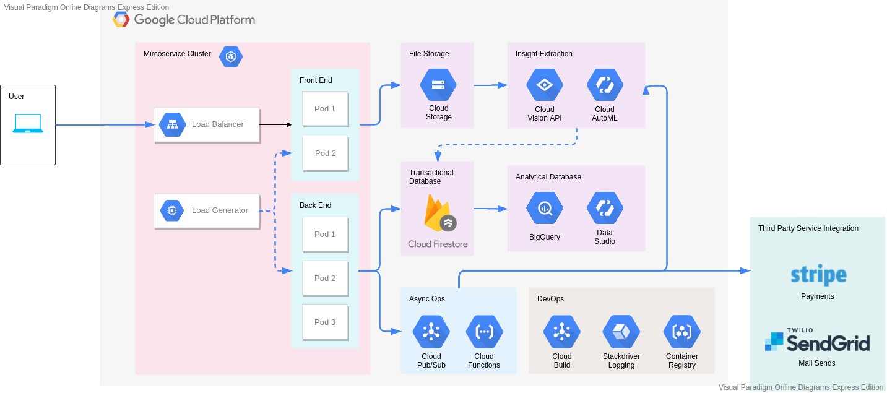

# Revamped Serverless Demo

This application is based on [this repository by Google™](https://github.com/GoogleCloudPlatform/serverless-store-demo)

## About this Application

Serverless Store is a basic prototype of an e-commerce web application, utilizing various Google Cloud Platform product and several other third party applications. Oh this web app, user can both upload a product to be sold, and purchase a product from other users. For payments, Serverless Store connects to [Stripe](https://stripe.com/) and [SendGrid](https://sendgrid.com/) to process payments via credit card and send email confirmation to users, respectively.

Serverless Store Web Application runs on Kubernetes (Google Kubernetes Engine). It consisted of two microservices that communicates internally using HTTP requests. There is also a load generator inside the Kubernetes cluster that simulates user activity.

Outside the web application (and the Kubernetes engine), this application also uses several other GCP Products:

| Products                | Usage                                                                                                                          |
| ----------------------- | ------------------------------------------------------------------------------------------------------------------------------ |
| Cloud Functions         | Performs event-driven jobs such as sending payments to Stripe, sending emails to customers, etc.                               |
| Firebase Authentication | An OAuth2.0 based authentication service that allows users to login with various means (Email, Google Account, Facebook, etc.) |
| Firestore Database      | NoSQL type database that stores user data                                                                                      |
| Cloud AutoML            | Machine Learning service for custom image classification                                                                       |
| Cloud Vision            | An image classification service that can label numerous store products accurately                                              |
| Cloud Storage           | Cloud service for storing files anywhere                                                                                       |
| Stackdriver Logging     | Cloud product that tracks program logs                                                                                         |

## Architecture

Serverless Store runs on sever interconnecting products and components. The diagram below visualizes the relationship between those components:



## Set Up Guide

Serverless Store is created in a way that can be easily set up and tear down as soon as the developer have a GCP Project with billing enabled.

- Add IAM Policy Binding between Kubernetes Service Account and GCP Service Account (There are 3 pairs)
- Add front end service's IP Address on Firebase Auth Authorized Domain

Before running this set-up guide, please make sure that you have all of the following:

- A Google Cloud Platform project with billing enabled.
- An account with owner as a role on the project mentioned before.
- Cloud SDK installed in your local machine (You can follow the installation guide [here](https://cloud.google.com/sdk/install)).

### Step 1: Initialize Firebase Project

In order to use Firebase product for your own Serverless Store, you need to set a Firebase Project for your GCP project.

- Go to [Firebase Console](https://console.firebase.google.com)
- Click "Add project" card on the Web UI
- On the first step of project creation, select your GCP Project, and click next.
- You will be given a reminder on the effects of adding Firebase to a Google Cloud Project. Select **Continue**.
- Turn off the "Enable Google Analytics for this project" switch and click **Add Firebase**.
- Wait a few minutes. You will be automatically redirected to your project's Firebase dashboard.
- On the overview page, click **Add App**, then select the web button (**</>**).
- Set the app name as you wish (e.g. "serverless-store"), and click **Register App**.
- Jot down the configuration given afterwards, specifically this part of the code:

```
  var firebaseConfig = {
    apiKey: YOUR_API_KEY,
    authDomain: YOUR_AUTH_DOMAIN,
    databaseURL: YOUR_DATABASE_URL,
    projectId: YOUR_PROJECT_ID,
    storageBucket: YOUR_STORAGE_BUCKET,
    messagingSenderId: YOUR_MESSAGE_SENDER_ID,
    appId: YOUR_APP_ID,
    measurementId: YOUR_MEASUREMENT_ID
  };
```

- Download the `firebase_config.json` file for yout new app.
- Place the configuration file from before into both your front end (`/src/frontend`) and back end (`/src/frontend`) folder.

### Step 2a: Setting up Firestore

There are some additional steps requires to get you firestore database up and running:

- In your Cloud Console page, navigate to **Firestore**
- Select **Select Native Mode** (Important! This is permanent)
- Select a location, such as `us-central1`
- Click **Create Database**. Your database will be created very soon!

### Step 2b: Customizing Firestore

Aside of creating the project, there are some components needed in order to ensure smooth data transaction between your app and Firestore

- Open [Firebase Console](https://console.firebase.google.com/)
- On the left drawer, go to **Cloud Firestore**
- Select the **Indexes** tab, and click **Add Index**
- A pop up will appear, asking you to specify the new index.
- Create the following five indexes (Order does not matter):

```
  Collection ID: carts
  Fields to index:
  - Field path: uid
  Index options: Ascending
  - Field path: item_id
  Index options: Ascending

  Collection ID: carts
  Fields to index:
  - Field path: uid
  Index options: Ascending
  - Field path: modify_time
  Index options: Descending

  Collection ID: carts
  Fields to index:
  - Field path: uid
  Index options: Ascending
  - Field path: modify_time
  Index options: Ascending

  Collection ID: promos
  Fields to index:
  - Field path: label
  Index options: Ascending
  - Field path: score
  Index options: Descending

  Collection ID: promos
  Fields to index:
  - Field path: label
  Index options: Ascending
  - Field path: score
  Index options: Ascending
```

### Step 3: Creating a Stripe account

Serverless Store connects with Stripe API for credit card payment processing. Doing so requires developer to have a Stripe account.

- Go to [Stripe main page](https://stripe.com/).
- Sign up a new Stripe account. Follow the instructions given.
- (Optional) If you so desired, you can further [activate your Stripe account](https://dashboard.stripe.com/account/onboarding). This requires several more information to be given to Stripe, including but not limited to: credit card information, bank details, and business purpose.
- Write down your test API **secret key** for later use. (Note: If you managed to activate your stripe account per previous step, you can use your live API secret key instead)

_Note: If you are using test API, your Serverless Store will only accept test credit card number. The details are described [here](https://stripe.com/docs/testing)._

### Step 4: Creating an AutoML Model

Cloud AutoML is a suite of machine learning products that enables developers with limited machine learning expertise to train high-quality models specific to their business needs. It relies on Google’s state-of-the-art transfer learning and neural architecture search technology.

One of the more specific use case of AutoML is image classification. In thi step, you will train a Machine Learning model using AutoML by feeding it with several test images.

- Go to [Cloud Storage](https://console.cloud.google.com/storage), click **Create Bucket**.
- Fill out the name of the bucket and set the location to `us-central1`.
- Collect a few images of pet and non-pet products. There should be at least 10 images for each group (so 20 total).
- Create a new file named `manifest.csv`, and write out the content using the pattern `[TYPE],[FILE_PATH],[LABEL]`
  - The `TYPE` element defines which dataset the image should go to. This can either be `TRAIN`, `VALIDATION`, or`TEST`. AutoML requires at least 1 `VALIDATION` image, 1 `TEST` image, and 8 `TRAIN` images for each category.
  - The `FILE_PATH` element defines the image location. This would normally be in the format `gs://[bucket_name]/[image_name].png`.
  - The `LABEL` element defines the type of object represented in the image. This element woule be `pets` for images of pet product, and `not_for_pets` for images of non-pet product.
  - This CSV file defines the list of images to be used by AutoML. Make sure that you enlist all images in the file.
- Upload `manifest.csv` file and all of the collected images to your newly created bucket.

Now that you have your training set inside a Cloud Storage bucket, you can create your AutoML model.

- Go to [Cloud Vision Datasets](https://console.cloud.google.com/vision/datasets), click **New Data Set**.
- Write the name of your new model (e.g. `pet_recommendations`).
- Ensure that `Single-Label Classification` option is chosen, and click `Create Dataset`.
- On the `import` tab, choose `Select a CSV file on Cloud Storage`.
- Write or browse your bucket's location, and click `Continue`.
- Wait a few minutes until all images are imported.
- Go to the `Train` tab and click `Start Training`.
- If asked, create 1 node for your AutoML model.
- Once the model is done, go to the `Model` page and write down the `Model ID`. It should be in the format `ICANXXXXXXXXXX...`

### Step 5: Enabling Cloud Vision

Google also offer image classification service for a more general purpose. Google Cloud’s Vision API offers powerful pre-trained machine learning models through REST and RPC APIs. For this application, we will use Cloud Vision to assign labels to product images and quickly classify them into several categories predefined by Google.

- [Enable Cloud Vision API](https://console.cloud.google.com/flows/enableapi?apiid=vision.googleapis.com)

### Step 6: Building Deployments

Before you can deploy your Kubernetes cluster, you need to push your modules to Google Container Registry

- Go to folder `/src/frontend`.
- Run the command `gcloud builds submit --tag gcr.io/[YOUR_GCP_PROJECT_NAME]/frontend:latest`.
- Go to folder `/src/backend`.
- Run the command `gcloud builds submit --tag gcr.io/[YOUR_GCP_PROJECT_NAME]/backend:latest`.

### Step 7: Build using Terraform

The remaining components (Pub/Sub, Cloud Functions, Service Accounts, GKE, Cloud Storage) will be created using Terraform. For details on this components, and how you can deploy it separately, refer to their respective docs. Keep in mind though, that you will need to sort out the component's dependency yourself. This means identifying which components should be deployed before which.

- Ensure that you have Terraform installed in your local machine by running `terraform version`. If your machine does not have Terraform installed, you can install it [here](https://learn.hashicorp.com/tutorials/terraform/install-cli).
- Go to `/terraform/microservices` and run `terraform init` on the command line.
- Run `terraform apply`.
- Fill out your GCP project name, AutoML model ID created on step 4, and Stripe API Token created on step 3 when prompted.
- Type `yes` when prompted, and wait until Terraform finish createing the remaining components. This may take 5-10 minutes.

### Step 9: Connect your Google Service Account to Kubernetes Service Account

Each microservice module deployed on your Kubernetes cluster requires specific permission to run properly (e.g. Reading Cloud Storage objects requires `Cloud Storage Viewer` role). This roles is already defined in your Terraform-generated Google Service Account. However, Kubernetes deployment uses Kubernetes Service Account for authorization. Therefore, you will need to link your GSA to KSA.

- Run the command `gcloud iam service-accounts add-iam-policy-binding --role roles/iam.workloadIdentityUser --member "serviceAccount:microservices.svc.id.goog[frontend/frontend-sa]" microservice-fr@[GCP_PROJECT_NAME].iam.gserviceaccount.com`. This command links your front end GSA (microservice-fr) to your front end's KSA (frontend-sa). Remember to replace `[GCP_PROJECT_NAME]` with your actual project name.
- Run the command `gcloud iam service-accounts add-iam-policy-binding --role roles/iam.workloadIdentityUser --member "serviceAccount:microservices.svc.id.goog[backend/backend-sa]" microservice-ba@[GCP_PROJECT_NAME].iam.gserviceaccount.com`. This command links your back end GSA (microservice-ba) to your back end's KSA (backend-sa). Remember to replace `[GCP_PROJECT_NAME]` with your actual project name.
- Run the command `gcloud iam service-accounts add-iam-policy-binding --role roles/iam.workloadIdentityUser --member "serviceAccount:microservices.svc.id.goog[loadgen/loadgen-sa]" loadgen@[GCP_PROJECT_NAME].iam.gserviceaccount.com`. This command links your load generator GSA (loadgen) to your load generator's KSA (loadgen-sa). Remember to replace `[GCP_PROJECT_NAME]` with your actual project name.

For more information on using Workload Identity, refer to [this documentation](https://cloud.google.com/kubernetes-engine/docs/how-to/workload-identity).

### Step 10: Add your Kubernetes Load Balancer to authorized domain list

Firebase Authentication restricts it's service to specific addresses only. In order to let you front end module use Firebase Authentication, you need to add it's IP address to authorized domain list.

- Go to [Kubernetes Engine Service & Ingress](https://console.cloud.google.com/kubernetes/discovery).
- Copy the front end's LoadBalancer endpoint.
- Go to [Firebase Authentication Sign-In Method] page by clicking **Authentication** on the main page navigation drawer.
- Enable Google as a Sign-In Provider.
- On the Authorized Domain list, click `Add Domain`.
- Paste the endpoint as the domain name, then click `Add`.

### Epilogue: Testing your Application

Try to access your Serverless Store application by going to frontend's endpoint you get on step 10.

If you can access the webpage without any problems, then congratulations! You have successfully set up your own Serverless Store application.

## Topic Based Documentation

This repository also integrates tools related to DevOps (Jenkins, Locust) and Data Science (BigQuery, Data Studio). Learn more about how this repository utilizes these tools here:

- [Simulating User Traffic using Locust](docs/LoadGenerator.md)
- [Continous Deployment using Jenkins](docs/ContinousIntegration.md)
- [Extracting Insights using BigQuery and Data Studio](docs/BigQuery.md)
