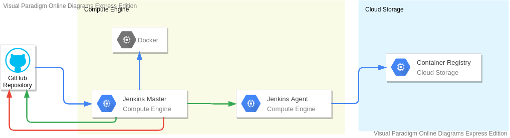

# Continous Deployment using Jenkins

Google Cloud Platform provides Jenkins as a CI/CD solution for our project. In the `Jenkinsfile` included in this repository, Serverless Store uses Jenkins to automate build, test, and submit Docker images to Google Container Registry. You can use Terraform or Spinnaker to deploy those images to Kubernetes deployment.

## Overview

Jenkins is a Continoud Integration tool that focuses on building projects. Much like other CI/CD tools such as GitLab or GitHub CI/CD, Jenkins is capable of running a pipeline - a set of commands that is executed in stages - and publishing it's result either on a web interface, or on the source control.

Jenkins runs as a standalone application in it's own process. This means running in a machine 24/7. To achieve this, Jenkins is usually run inside a server or a virtual machine in a cloud provider.

Jenkins is very customizable due to it's abundance of plugins. This makes Jenkins a preferrable option for CI/CD when working with various cloud providers. With the correct tools, Jenkins can work with your cloud provider to provision multiple VMs to run your pipeline.

Jenkins runs on pipelines. When a pipeline is triggered, it is run on Jenkin's main machine called "Master agent". This agent manages the overall pipeline execution.

To execute stages, Jenkin's master agent can call multiple stage agents to run stages for it. Each stage agents runs exactly one stage (unless there are multiple stages with the same agent configuration. In that case, Jenkins may reuse it's stage agents).

For our development purpose, stage agents is a Virtual Machine that is provisioned by Google Cloud. Because stage agents is a Virtual Machine, we can use our custom machine image to run stages.

Serverless Store's development pipeline contains two stages: `test` and `dockerize`. Testing stage will be run in a docker with Python and NodeJS pre-installed. Dockerize stage is the stage where docker images are built and pushed to GCR. Because `docker` requires a daemon to run, we will run a custom stage agent with custom machine image to build the docker image. This custom image will have GCloud SDK pre-installed, to make image pushing easier.

## Architecture

The diagram below visualize the process of Continous Integration with Jenkins. GitHub pushes it's repository changes to Jenkins, from which it will run two separate stages. The first unit testing stage runs on a Docker managed on Jenkins main agent. After all the tests run successfully, Jenkins deploy a stage agent that builds and pushes repository to GitHub. Jenkins will inform the build status to GitHub after all processes are completed.

## Setting Up Jenkins for Serverless Store

Setting up Jenkins in a Google Cloud project is easy. GCP Deloyment Manager will automatically build a VM with Jenkins installed for you. Configuring Jenkins to run our pipeline, however, is a bit more tricky.

### Step 1: Deploy Jenkins

- Go to [Deployment Manager](onsole.cloud.google.com/dm/deployments), click **Deploy Marketplace Solutions**.
- Search and choose for "Jenkins (Google Click to Deploy)".
- Click **Launch**.
- Give your Jenkins deployment a name and location.
- Leave the rest of the field and click **Deploy**.
- Your Jenkins deployment should be running in a few minutes.
- Write down the IP address, username and password for your Jenkins deployment.
- Go to the specified IP Address, and try to log in with your initial account.

### Step 2: Completing your initial setup

You now have Jenkins in your Google Cloud project. However, you may want to do several updates before creating your first pipeline.

- SSH to your Jenkins deployment. Go to **Deployment Manager** and click **SSH**.
- Try to run `sudo apt-get update`.
  - If your SSH shows an error NO_PUBKEY, copy the key ID (e.g. 40976EAF437D05B5) and run `sudo apt-key adv --keyserver keyserver.ubuntu.com --recv-keys [KEY_ID]`.
    - If this command gives an error because `dirmngr` does not exist, run `sudo apt-get install dirmngr --install-recommends` and retry previous command.
  - After you have added the key to jenkins instance, run `sudo apt-get update` again.
- Upgrade your Jenkins to the latest version by running `sudo apt-get upgrade jenkins`
- Wait until your latest version has been downloaded and Jenkins is up and running.
- Install docker by following [this guide for Debian 9](https://docs.docker.com/engine/install/debian/)
- Allow Jenkins to use Docker by running command `sudo usermod -aG docker jenkins`
- Visit your Jenkins IP address.
- Go to **Manage Jenkins** -> **Manage Plugins**.
- There will be a long list of updateable plugins. Scroll down to the very bottom of the page, and click **Compatile** to upgrade all compatible plugins.
- Go to the **Available** tab.
- Search for **Google Compute Engine** these plugins and check their box:
  - Google Compute Engine
  - GitHub Authentication
  - GitHub Integration
- Click **Download now and install after restart**.
- To restart Jenkins as soon as all of the plugins are installed, check the "Restart Jenkins when installation is complete and no jobs are running" box.
- Wait until Jenkins has sucessfully restarted.

### Step 3: Configuring Jenkins Credentials

Serverless Store pipeline requires Jenkins to be able to provision VMs on your Google Cloud Project. To do this, Jenkins requires a Google Service Account with necessary permissions. You also need to create a GSA with Storage Admin role to be used by stage agents to push Docker images.

- Create a jenkins GSA (Google Service Account). If you have run Terraform in the main set-up guide, this account will be made for you. Otherwise, follow these steps:
  - Go to the [Service Account List](https://console.cloud.google.com/iam-admin/serviceaccounts) and click **Create Service Account**.
  - Name the service account "jenkins", make sure the service account ID is `jenkins@[YOUR_PROJECT_NAME].iam.gserviceaccount.com", and click **Create**
  - In the Service Account permissions, add these roles to the list:
    - Compute Instance Admin (v1)
    - Compute Network Admin
    - Compute Security Admin
    - Service Account User
  - Click **Continue**, and then **Done**.
- Go to the Service Account List, click the service account you have just created.
- Click **Add Key** -> **Create New Key**.
- Select JSON as key type.
- Your key should be downloaded very soon.
- Go back to your Jenkins page
- Click **Manage Jenkins** -> **Manage Credentials**
- Click the dropdown on "(global)", and click **Add Credentials**
- Add these informations:
  - Kind: Google Service Account from private key
  - Project name: [YOUR_PROJECT_NAME]
  - Type: JSON Key
- Click **OK**

### Step 4: Configuring Stage Agent Credentials

Serverless Store pipeline requires Jenkins to be able to provision VMs on your Google Cloud Project. To do this, Jenkins requires a Google Service Account with necessary permissions. You also need to create a GSA with Storage Admin role to be used by stage agents to push Docker images.

- Go to the [Service Account List](https://console.cloud.google.com/iam-admin/serviceaccounts) and click **Create Service Account**.
- Name the service account "docker-pusher", make sure the service account ID is "docker-pusher@[YOUR_PROJECT_NAME].iam.gserviceaccount.com", and click **Create**
- In the Service Account permissions, add these roles to the list:
  - Storage Admin
- Click **Continue**, and then **Done**.
- Go to the Service Account List, click the service account you have just created.
- Click **Add Key** -> **Create New Key**.
- Select JSON as key type.
- Your key should be downloaded very soon.
- Go back to your Jenkins page
- Click **Manage Jenkins** -> **Manage Credentials**
- Click the dropdown on "(global)", and click **Add Credentials**
- Add these informations:
  - Kind: Secret File
  - File : Use the docker-pusher JSON key you have downloaded
  - ID : docker-pusher
- Click **OK**

### Step 5: Creating your custom VM image

Jenkins's stage agent requires Java to run properly. Aside of that, your stage agent also require GClous SDK to be able to push images to Google Container Registry. To create a new VM image, you need Packer form HashiCorp.

- Open Cloud Shell.
- In the Cloud Shell, set your project ID by running `gcloud config set project [PROJECT_ID]`.
- In the Cloud Shell, run `packer-build.sh` by either copy and pasting the content from the bash file to Clod Shell, or by copying file into Cloud Shell's directory, then run `chmod +x packer-build.sh | ./packer-build.sh`
- By the time all of hte commands finished running, there should be a new machine image named `jenkins-agent-...`. Jot down the image name as you will need it later.

### Step 6: Add Google Cloud as a provider for Jenkins

- Go to **Manage Jenkins** -> **Manage Nodes and Clouds** -> **Configure Clouds**.
- Click **Add a new cloud** -> **Google Compute Engine**.
- Fill out the necessary requirements:
  - Name : GCE Agents
  - Project ID : [YOUR_PROJECT_NAME]
  - Instance Cap : 1
  - Service Account Credentials : Select the credentials you have previously added
- Add a new instance configuration with this info:
  - Name Prefix : jenkins-deployer
  - Description : An Agent with GCloud SDK installed to build and deploy Docker images
  - Labels : jenkins-deployer
- In the **Location** section, choose the nearest Region and Zone from you.
- In the **Machine Configuration** section, click **Advanced**
- Add these information:
  - Machine Type : n1-standard-1
- In the **Networking** section, fill this information:
  - Network : default
  - Subnetwork : default
- In the **Boot Disk** secion, fill this information:
  - Image project : [YOUR_PROJECT_NAME]
  - Image name : Select the name of the image you created on step 5

### Step 7: Add your GitHub Credential to Jenkins:

- Click **Manage Jenkins** -> **Manage Credentials**
- Click the dropdown on "(global)", and click **Add Credentials**
- Add these informations:
  - Kind: Username with Password
  - Username: [YOUR_GITHUB_USERNAME]
  - Password: [YOUR_GITHUB_PASSWORD]

### Step 8: Create your pipeline

- Go to Jenkin's main page, click **New Item**.
- Enter a pipeline name of your choice. Make the type **Multibranch Pipeline**
- Fill out these informations:
  - **Branch Sources**
    - Project Repository : Your GitHub repository link
    - Credentials : Select the credentials you have added in step 5
  - **Build Configuration**
    - Mode : by Jenkinsfile
    - Script Path : Jenkinsfile
  - **Scan Multibranch Pipeline Triggers**
    - Check **Periodically if not otherwise run**
    - Interval : 1 minute
  - **Orphaned Item Strategy**
    - Check **Discard old items**
    - Days to keep old items : 1
- Click **Save**

After completing all of these steps, you should now have a fully automated Jenkins agent that listens for changes in your GitHub repository, builds and pushed Docker images to Google Container Registry.
