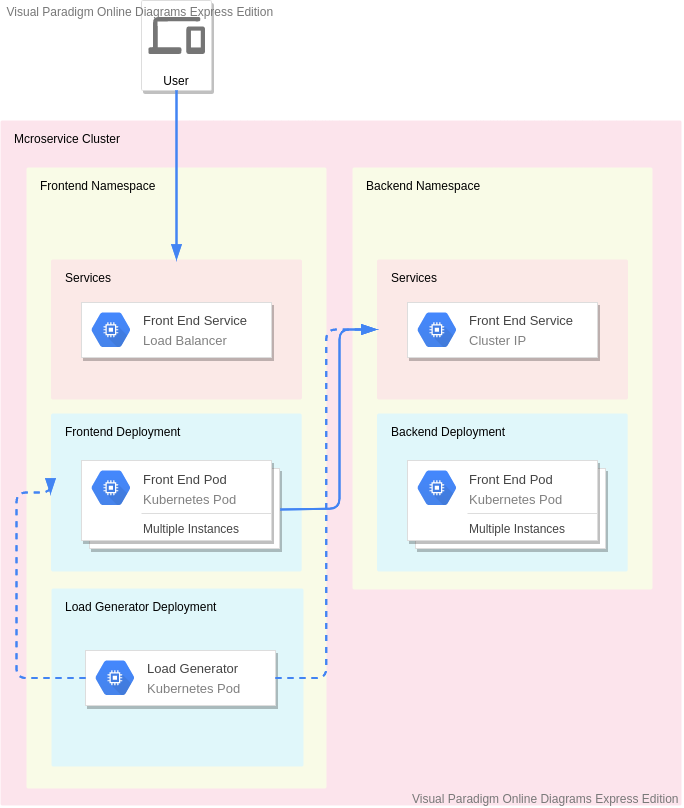

# Locust as Load Generator for Serverless Store

## Architecture

Locust load generator runs as a single deployment inside our Kubernetes Cluster. This load generator interacts with both frontend and backend internally. Load generator tries to simulate user behaviour as accurately as possible, only performing actions directly through back end only in absoulte necessary (e.g. when an action requires user to login via Firebase Authentication).

### Set Up Guide

For guide on installing load generator, follow the guide of [setting up Kubernetes](../k8s/microservices/README.md)
