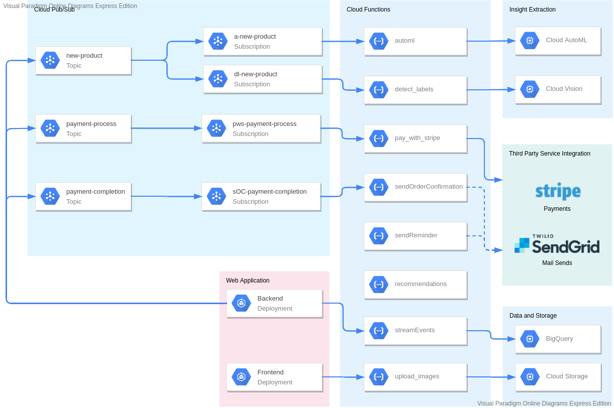

# Cloud Functions for Serverless Store

Serverless Store uses Cloud Functions to perform several asynchronous process. It is part of the Event-Driven Design that Serverless Store was initially built from. This design makes workflow automation easier than ever, and enables auto-entry, persistent logging, and many more features in the app.

## Function List

Below are the list of functions deployed to Cloud Functions, along with their respective purposes:

| Name                  | Language | Usage                                                                | Trigger Type                 |
| --------------------- | -------- | -------------------------------------------------------------------- | ---------------------------- |
| automl                | python37 | Delivers image to Cloud AutoML for image classification              | Pub/Sub (new-product)        |
| detect_labels         | python37 | Delivers image to Cloud Vision for labelling                         | Pub/Sub (new-product)        |
| pay_with_stripe       | python37 | Triggers Stripe API to process paments via credit card               | Pub/Sub (payment-process)    |
| recommendation        | nodejs10 | Gets product recommendation form Google Sheets                       | HTTP                         |
| sendOrderConfirmation | nodejs10 | Send an order confirmation email to user                             | Pub/Sub (payment-completion) |
| sendReminder          | nodejs10 | Send a reminder email periodically to user with leftover cart        | HTTP (POST)                  |
| streamEvents          | nodejs10 | Perform an insertion to BigQuery table each time a user event occurs | HTTP (POST)                  |
| upload_image          | python37 | Uploads image from FilePond to Cloud Storage                         | HTTP (POST)                  |

## Architecture

The diagram below visualizes how each Cloud Functions are triggered, and the processes they invoked during their runtime.

## Setting up Cloud Functions (and other necessary components)

Cloud Functions (along with Pub/Sub topics and Cloud Storage Bucket) is set up automatically by Terraform. If you prefer to deploy them manually, follow steps below:

### Prerequisite

This guide assumes that you have completed the first 7 steps of the main set-up guide.

### Step 1: Create a Cloud Storage bucket for product images

Serverless store it's product images in a Cloud Storage bucket.

- Go to [Cloud Storage Browser](https://console.cloud.google.com/storage/browser) and click **Create Bucket**.
- Fill out the name of your bucket and it's location. Remember the bucket name as it will be needed later.

### Step 2: Create Pub/Sub topics

You need to create Pub/Sub topics in order to trigger your function properly.

- Go to [Pub/Sub Topic List](https://console.cloud.google.com/cloudpubsub/topic/list) and click **Create Topic**.
- For the topic ID, write down `new-product` and click **Create Topic**.
- Do the same steps to create topic `payment-process` and `payment-completion`.

### Step 3: Set up the environment variabes

With the necessary components filled out, you can set up your function's environment variables.

- Open file `/extras/cloudbuild/functions_env_vars.yaml`.
- Fill out the `AUTOML_MODEL_ID`, `GCS_BUCKET`, `STRIPE_API_KEY`, `PUBSUB_TOPIC_PAYMENT_COMPLETION`, and `SENDGRID_API_KEY` (if you have one). If you have followed the previous step accurately, you do not need to change the value of `PUBSUB_TOPIC_PAYMENT_COMPLETION`.

### Step 4: Deploy your functions to the Cloud

It is time to finally deploy your cloud functions.

- Go to folder `/functions`
- Run the bash file `setup.sh`. You may need to give it executable permission by running `sudo chmod +x setup.sh` first.
- Each line in the setup file deploys one specific Cloud Function. It may take 1-2 minutes for each file to be deployed.
